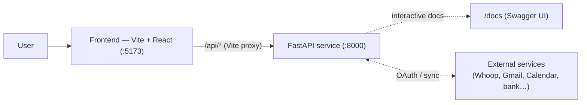
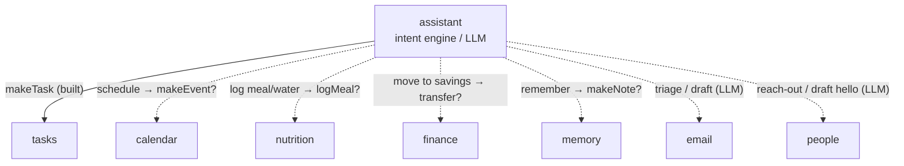
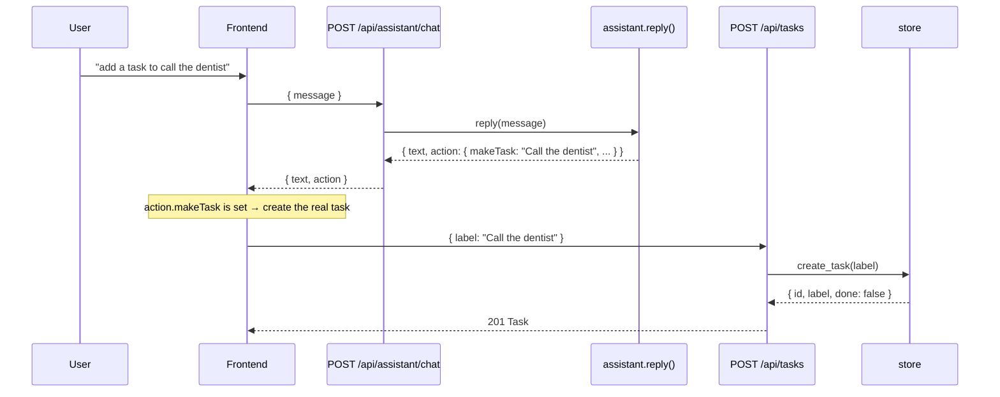

# Backend Overview — Architecture

> Status: draft · Last updated: 2026-06-09 · Owner: _TBD_
>
> The overarching doc: what the backend is, the functions it's made of, and — the main
> point — **how those functions interact**. Each function has its own doc; this one is
> the map between them.

## Responsibility

The backend is the **system of record and intelligence layer** for the Scuffed OS desktop
dashboard, built with **FastAPI**. The target is one backend function per surface of the
app.

Today **three** are built; the other seven render sample data inside their React screens
and are documented here as the **planned** backend they should grow into:

| Function | Doc | Status | Backing today |
| --- | --- | --- | --- |
| Assistant | [assistant.md](assistant.md) | ✅ Built | Intent engine (`assistant.py`) |
| Tasks | [tasks.md](tasks.md) | ✅ Built | In-memory store |
| Memory | [memory.md](memory.md) | ✅ Built | In-memory store |
| Calendar | [calendar.md](calendar.md) | ⬜ Planned | Sample data in `CalendarScreen.jsx` |
| Habits | [habits.md](habits.md) | ⬜ Planned | Sample data in `HabitsScreen.jsx` |
| Nutrition | [nutrition.md](nutrition.md) | ⬜ Planned | Sample data in `NutritionScreen.jsx` |
| Fitness | [fitness.md](fitness.md) | ⬜ Planned | Sample data in `FitnessScreen.jsx` (Whoop) |
| Finance | [finance.md](finance.md) | ⬜ Planned | Sample data in `FinanceScreen.jsx` |
| Email | [email.md](email.md) | ⬜ Planned | Sample data in `EmailScreen.jsx` |
| People | [people.md](people.md) | ⬜ Planned | Sample data in `CRMScreen.jsx` |
| _Data store_ | [data-store.md](data-store.md) | ✅ Built | Shared in-memory store + Pydantic schemas |

> The frontend **degrades gracefully** — if the backend is down (or a surface has no
> backend yet), the screens fall back to their seeded sample data. The backend is an
> enhancement (real persistence + intelligence + a single source of truth), not a hard
> dependency for the UI to render.

## System context



- In dev, Vite proxies `/api/*` to `http://localhost:8000`; **CORS** is also enabled for
  `localhost:5173` / `127.0.0.1:5173` (`main.py`).
- The planned surfaces are integration-heavy — several are mostly **mirrors of external
  systems** (see [External integrations](#external-integrations)).

## Architecture pattern

A thin **layered** design, repeated per function:

```
routers/<fn>.py   (HTTP surface, validation)
      │
      ▼
<fn> service / store   (behavior + state)
      │
      ▼
schemas.py   (shared data contracts)
```

- **Routers** hold no state; they validate (via `schemas.py`) and delegate.
- **State** lives behind the data layer ([data-store.md](data-store.md)) — one swap seam
  from in-memory to a real DB.
- **The assistant holds no state** — it's a pure function, which is what keeps the
  "drop in a real LLM" seam clean.

New functions should follow the built ones (`routers/tasks.py` + `store.py` +
`schemas.py`) as the template.

## How the functions interact

Two infra pieces are shared by everyone, and the **assistant is the hub** that ties the
feature functions together.

**Shared infrastructure**

- **`schemas.py`** — the common vocabulary; every router depends on it, it depends on
  nothing.
- **`store.py`** (→ future DB) — the single source of mutable state; every stateful
  function persists through it.

**Assistant as the hub**



Today the assistant only **writes** to one function — Tasks, via an `action.makeTask`
that the client POSTs to `/api/tasks` (it never writes server-side, so `/chat` stays
stateless). For every other intent it just returns a **deep-link** to the relevant
screen. The defining cross-cutting decision for the planned work is how that generalizes:
mirror the `makeTask` pattern per domain (`makeEvent`, `logMeal`, `transfer`, `makeNote`),
or have the assistant call domain services directly. See [assistant.md](assistant.md).

**Direct cross-domain links** (independent of the assistant)

| From → To | Link |
| --- | --- |
| Tasks → Calendar | Task `deadline`/`reminders` surface as calendar entries. |
| Email → Tasks | "Needs reply" message → a task. |
| Email → Calendar | Dates in messages (lease decision, dinner) → events. |
| Email → People | Senders are contacts; updates `last_contacted`. |
| Finance → Calendar | Subscription renewals / bill due dates → reminders. |
| Fitness → Calendar | "Recovery is high — schedule a hard session." |
| Habits ↔ Fitness/Nutrition | A logged workout/water could auto-complete a habit. |
| Memory ↔ People | Memories reference contacts ("loop in Priya"). |

### Cross-section flow: "add a task" via the assistant (built today)



## External integrations

Several planned functions are integration-first — much of their data originates outside
the app:

| Function | External system | Shape |
| --- | --- | --- |
| Fitness | **Whoop** API | Recovery/strain/sleep/vitals/workouts ingest. |
| Email | **Gmail / IMAP+SMTP** | Inbox sync + send. |
| Calendar | **Google Calendar** | Event import / two-way sync. |
| Finance | **Plaid-style aggregation**, market data | Accounts/transactions + holding prices. |
| People | Contacts provider, email/calendar activity | Contacts + interaction history. |

Open cross-cutting questions: OAuth/token storage per user, webhook vs. scheduled pull,
and whether each function is a read-only **mirror** or our own **canonical record**.

## Cross-cutting concerns

- **Assistant statelessness.** `/api/assistant/chat` is a pure function of its input — the
  clean seam for a real LLM. See [assistant.md](assistant.md).
- **Shared LLM client.** Assistant, Email triage/drafting, and People outreach are all
  LLM-backed — they should share one model client/config rather than three. _TODO._
- **Concurrency.** FastAPI runs sync endpoints in a threadpool; the store guards mutations
  with a `threading.Lock`. See [data-store.md](data-store.md).
- **Persistence.** None yet — in-memory, resets on restart. The store is the swap seam to
  a real DB; every planned function depends on that landing.
- **Error handling.** Every non-2xx response uses a consistent envelope —
  `{ "error": { "code", "message", "details"? } }` (`app/errors.py`) — so clients can
  branch on a stable `code` instead of parsing prose.
- **Auth / multi-user.** None — single local user. The biggest fork for the schema once
  external accounts and an iPhone client arrive. _TODO._

## How it _should_ function

> The target architecture you're authoring. Seeds drawn from the README's direction:

- [ ] **Real persistence** for the three built functions (Supabase-hosted Postgres +
      SQLAlchemy behind the same store interface — see [data-store.md](data-store.md)).
- [ ] **Real assistant** — live LLM returning the same `{ text, action }` shape, with a
      generalized write path to domains (beyond `makeTask`).
- [ ] **Graduate the seven planned functions** from React sample data to real endpoints +
      integrations. Suggested order is yours to set (Email and Finance are the heaviest).
- [ ] **Auth & multi-user** for external accounts and the future iPhone client.

## Open questions / future work

- **Two task models** — the simple home/assistant list vs. the rich Tasks-screen model
  (subtasks, files, lists, priority). Reconcile before adding fields piecemeal. See
  [tasks.md](tasks.md).
- **Assistant write pattern** — per-domain `makeX` actions vs. direct service calls.
- **One LLM service** shared across assistant / email / people, or separate modules.
- **Error model & `/api` versioning** once a second client consumes the surface.
