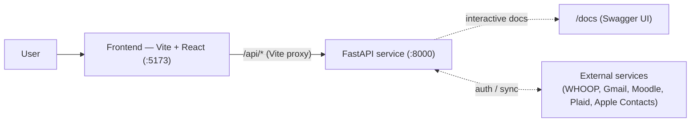
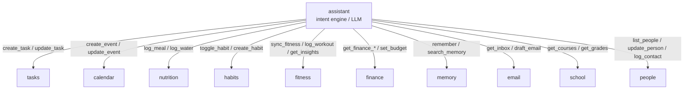
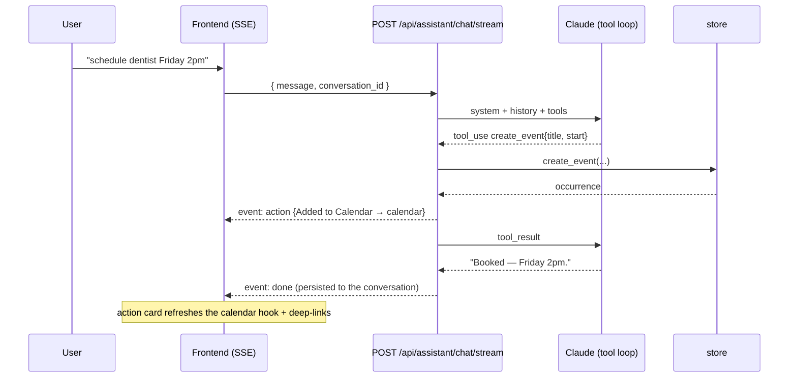

# Backend Overview — Architecture

> Status: current · Last updated: 2026-07-21 · Owner: _TBD_
>
> The overarching doc: what the backend is, the functions it's made of, and — the main
> point — **how those functions interact**. Each function has its own doc; this one is
> the map between them.

## Responsibility

The backend is the **system of record and intelligence layer** for the Scuffed OS desktop
dashboard, built with **FastAPI**. The target is one backend function per surface of the
app.

**Every feature surface now has a live backend** behind `/api/*`. Tasks and Memory retain
sample-data fallbacks when the backend is unavailable; the remaining surfaces show
API-backed empty/error states rather than pretending sample data is live. The
integration-heavy ones (Fitness, Email, School, Finance, People) sync from an external
system; the rest are local domains persisted in Postgres. Where a status below reads
`s1`/`s2`, that slice is live and later slices are still scoped in the function's own doc:

| Function | Doc | Status | Backing today |
| --- | --- | --- | --- |
| Assistant | [assistant.md](assistant.md) | ✅ Built (M2) | Claude tool loop + SSE + Mem0 memory |
| Tasks | [tasks.md](tasks.md) | ✅ Built (M1, +M3 extras) | Postgres; reminders fire, files upload, recurrence |
| Memory | [memory.md](memory.md) | ✅ Built (M1/M2) | Postgres + Mem0/pgvector |
| Calendar | [calendar.md](calendar.md) | ✅ Built (M3) | Postgres; recurrence expanded on read (**local domain, not Google-synced**) |
| Habits | [habits.md](habits.md) | ✅ Built (M3) | Postgres; completion log + linked auto-complete |
| Nutrition | [nutrition.md](nutrition.md) | ✅ Built (M3) | Postgres + USDA food DB lookup |
| Fitness | [fitness.md](fitness.md) | ✅ Built (M4) | Postgres; live **WHOOP** sync (recovery/strain/sleep/workouts) |
| Insights | [fitness.md](fitness.md) | ✅ Built | Derived WHOOP-style coaching over fitness data, generated automatically after a scored recovery; manual refresh is available |
| Email | [email.md](email.md) | ✅ Built (M5) | Live **Gmail** sync + AI triage + draft replies |
| School | [school.md](school.md) | ✅ Live (M6 s1, read-only) | Live **Moodle** (WolfWare): courses, deadlines, grades, announcements |
| Finance | [finance.md](finance.md) | ✅ Implemented (M7 s2; Plaid data read-only, local budgets writable; production-pull validation outstanding) | **Plaid** implementation: accounts, budgets, transactions, net worth, holdings, and bills; real production validation remains outstanding |
| People | [people.md](people.md) | ✅ Built (M10 s1) | Postgres CRM + local **Apple Contacts** import (read-only, off by default) |
| _Data store_ | [data-store.md](data-store.md) | ✅ Built | Configured Postgres + pgvector + SQLAlchemy/Alembic store + Pydantic schemas |

> Two later milestones are cross-cutting infrastructure rather than feature surfaces:
> **M8** ships the whole thing as a packaged macOS Tauri app (bundled Python + Postgres;
> see [ship.md](ship.md)), and **M9** adds the in-app **Settings › Connectors** sign-in
> surface + machine-bound secrets vault.

> The frontend **degrades gracefully** — if the backend is down, Tasks and Memory retain
> seeded sample fallbacks, other screens show empty/error states, and the assistant drops
> to a labeled capture-only mode. The shell can still render, but persistence,
> integrations, and intelligence depend on the backend.

## System context



- In dev, Vite proxies `/api/*` to `http://localhost:8000`; **CORS** is also enabled for
  `localhost:5173` / `127.0.0.1:5173` and, in the packaged app, the `tauri://localhost`
  webview origin (`main.py`).
- The integration surfaces are integration-heavy — several are read-only **mirrors of
  external systems** (see [External integrations](#external-integrations)).

## Architecture pattern

A thin **layered** design, repeated per function:

```
routers/<fn>.py   (HTTP surface, validation)
      │
      ▼
<fn> service / store   (behavior + state)
      │
      ▼
schemas.py   (shared data contracts)
```

- **Routers** hold no state; they validate (via `schemas.py`) and delegate.
- **State** lives behind the data layer ([data-store.md](data-store.md)) — the single
  seam every stateful function persists through, which is what let the store swap from
  in-memory to Postgres (M1) without touching a router.
- **The assistant holds no state of its own** — conversations and memories persist
  through the same store, which is what kept the "drop in a real LLM" seam clean when the
  live Claude tool loop landed (M2).

New functions should follow the built ones (`routers/tasks.py` + `store.py` +
`schemas.py`) as the template.

## How the functions interact

Two infra pieces are shared by everyone, and the **assistant is a hub** — every feature
domain now exposes tools.

**Shared infrastructure**

- **`schemas.py`** — the common vocabulary; every router depends on it, it depends on
  nothing.
- **`store.py`** (→ Postgres) — the single source of mutable state; every stateful
  function persists through it.

**Assistant as the hub**



Since M2 the assistant acts **server-side** through its tool loop (`app/tools.py`). Local
domains take full CRUD: tasks (create/update/
delete, reminders, recurrence), memory, calendar (`create_event`/`update_event`/
`delete_event`), habits (`toggle_habit`/`create_habit`), nutrition (`log_meal`/
`log_water`/`search_food`). The integration domains are reachable too: fitness
(`sync_fitness`, `log_workout`, `get_fitness_*`, `get_insights`), email (`get_inbox`,
`get_email`, `draft_email`; sending stays in the Email UI), school
(`get_courses`/`get_deadlines`/`get_grades`), and finance — read-only for synced bank data
(`get_finance_summary`, `get_transactions`,
`get_networth`, `get_holdings`), but with writable app-native budgets (`set_budget`,
`reallocate_budget`). People reads through `list_people`/`get_person` and writes only the
app-native CRM layer (`create_person`, `update_person`, `log_contact`) — identity on
imported contacts belongs to the Apple Contacts sync, and there is no delete tool.
Every executed write returns an **action card** deep-linking to its screen. See
[assistant.md](assistant.md).

**Direct cross-domain links** (independent of the assistant)

| From → To | Link |
| --- | --- |
| Tasks → Calendar | Planned: task deadlines as client-side calendar overlays (not built). |
| Nutrition → Habits | **Built (M3):** hitting the water goal auto-completes a water-linked habit (auto rows never clobber manual taps). |
| Fitness → Habits | **Built and firing (M3 machinery, live since M4):** a synced or logged workout auto-completes a workout-linked habit (`store.upsert_workout`). |
| Fitness → Insights | **Built:** each fitness sync regenerates the day's derived coaching cards (once-a-day gate). |
| School → Calendar / Tasks | **Built:** synced Moodle deadlines and assignments project into Calendar and Tasks reads. |
| Finance → Calendar | **Built:** recurring bills/subscriptions project as calendar events; notification reminders are not implemented. |
| Email → Tasks / Calendar / People | Not built as direct projections; these remain future cross-domain work. |
| Fitness → Calendar | Not built; coaching may suggest a session but does not schedule one automatically. |
| Memory ↔ People | Not built as a structured link. |

### Cross-section flow: "schedule dentist Friday 2pm" via the assistant (built)



## External integrations

Several functions are integration-first — much of their data originates outside the app.
All of the below are **implemented**; see the function docs for live-production and
packaged-app acceptance caveats:

| Function | External system | Shape |
| --- | --- | --- |
| Fitness | **WHOOP** API (OAuth) | Recovery/strain/sleep/vitals/workouts ingest (read-only). |
| Email | **Gmail** API (OAuth) | Inbox sync + send; scopes `gmail.readonly` + `gmail.modify` + `gmail.send`. |
| School | **Moodle** (WolfWare, pasted token) | Courses/deadlines/grades/announcements (read-only). |
| Finance | **Plaid** | Accounts/transactions/holdings/balances (read-only). |
| People | **Apple Contacts** (local, Full-Disk-Access) | One-way, read-only contact import; off by default. |

> **Calendar is _not_ an integration.** It is a local Postgres domain with its own
> recurrence engine — there is no Google Calendar sync, and the Google OAuth scope set is
> Gmail-only. Importing external calendars remains future work.

Settled since this doc was first written: API keys and provider client credentials live in
the machine-bound AES-256-GCM secrets vault (M8 slice-2); OAuth/access tokens live in
`provider_accounts`, with Plaid access tokens in `finance_items`. Connections are managed
from **Settings › Connectors** (M9). Integrations use scheduled pulls from FastAPI lifespan
loops (no webhooks). WHOOP, Moodle, Plaid, and Apple Contacts ingest external data; Gmail
also supports send/reply/forward/trash/labels. App-native CRM metadata, budgets, and manual
workouts remain writable. Still open: sync-cadence tuning and backfill windows.

## Cross-cutting concerns

- **Shared LLM client.** `app/llm.py` (M2) is the one model client, and every LLM
  consumer reuses it rather than growing its own: the assistant tool loop, Email triage
  and draft replies (M5), and the Insights phraser (which also has a template fallback
  for when the model is unavailable).
- **Concurrency.** FastAPI runs sync endpoints in a threadpool; the store opens a
  fresh SQLAlchemy session per call over a small pool. See [data-store.md](data-store.md).
- **Background work.** M3 introduced the first in-process background job — the reminder
  tick (`app/reminders.py`, started in the FastAPI lifespan). Integration sync loops follow
  the same lifespan pattern; explicit `POST /api/<fn>/sync` endpoints provide on-demand
  runs. The packaged shell hosts the backend but does not drive its sync schedule.
- **Persistence.** Postgres via SQLAlchemy/Alembic (M1) — the DSN is configurable, so it
  may be local, remote, or the app-managed PostgreSQL 17 + pgvector that the packaged app
  bundles (M8). Local artifacts that stay out of the DB: Mem0's history SQLite and task
  attachment bytes under `backend/data/`, plus imported contact photos under
  `app_support_dir/contact_photos`.
- **Secrets.** In the packaged app, API keys and provider client credentials entered in
  Settings live in a machine-bound AES-256-GCM vault (`app/secrets.py`, M8 slice-2).
  Development may instead supply them through environment or `.env` configuration.
  Provider access/refresh tokens persist in server-side database tables, not in the vault.
- **Error handling.** Every non-2xx response uses a consistent envelope —
  `{ "error": { "code", "message", "details"? } }` (`app/errors.py`) — so clients can
  branch on a stable `code` instead of parsing prose.
- **Auth / multi-user.** None — single local user. The biggest fork for the schema once
  external accounts and an iPhone client arrive. _TODO._

## How it _should_ function

> The target architecture you're authoring. Seeds drawn from the README's direction:

- [x] **Real persistence** for the three built functions — M1 (2026-06-10):
      Postgres + SQLAlchemy + Alembic behind the same store
      interface; one rich task model (D1) resolved the two-model split — see
      [data-store.md](data-store.md) and [tasks.md](tasks.md).
- [x] **Real assistant** — M2 (2026-06-10): Claude tool loop server-side, SSE
      streaming, persistent conversations, Mem0 auto-capture memory.
- [x] **Local domains** — M3 (2026-06-10): calendar (+shared recurrence engine),
      habits (+linked auto-complete), nutrition (+USDA food DB), firing reminders,
      real file attachments, recurring tasks — with assistant tools for all.
- [x] **Graduate the integration functions** from React sample data — all landed, in a
      different order and numbering than originally guessed above: Fitness/WHOOP (M4),
      Email/Gmail (M5), School/Moodle (M6), Finance/Plaid (M7), People/CRM + Apple
      Contacts (M10 s1), plus a derived Insights surface over the fitness data.
- [x] **Ship it as a real app** — M8: Tauri bundle with vendored Python + app-managed
      PostgreSQL 17 + pgvector; M9: in-app Settings › Connectors sign-in over a
      machine-bound secrets vault. See [ship.md](ship.md).
- [ ] **Auth & multi-user** for external accounts and the future iPhone client.

## Open questions / future work

- **Auth / multi-user.** Still none — single local user. This is the biggest schema fork
  once the iPhone client arrives.
- **Sync cadence & backfill windows** per integration — currently lifespan-driven loops
  plus explicit `POST /api/<fn>/sync`; no webhooks.
- **Calendar import.** Calendar is local-only today; pulling in Google Calendar (or any
  external calendar) is unbuilt and would need a new OAuth scope.
- **Error model & `/api` versioning** once a second client consumes the surface.
