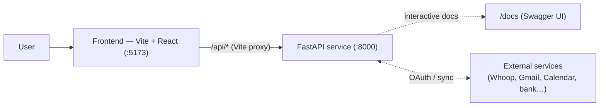
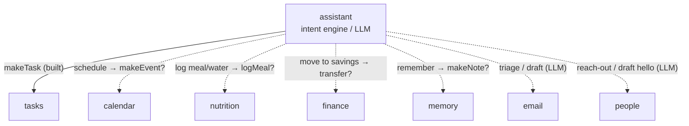
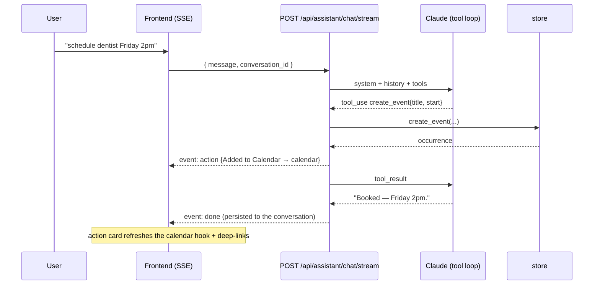

# Backend Overview — Architecture

> Status: current (through M9) · Last updated: 2026-07-11 · Owner: _TBD_
>
> The overarching doc: what the backend is, the functions it's made of, and — the main
> point — **how those functions interact**. Each function has its own doc; this one is
> the map between them.

## Responsibility

The backend is the **system of record and intelligence layer** for the Scuffed OS desktop
dashboard, built with **FastAPI**. The target is one backend function per surface of the
app.

**Ten** functions are built and live; only **People/CRM** still lacks a backend
(its React screen renders static contacts):

| Function | Doc | Status | Backing today |
| --- | --- | --- | --- |
| Assistant | [assistant.md](assistant.md) | ✅ Built (M2) | Claude tool loop + SSE + Mem0 memory |
| Tasks | [tasks.md](tasks.md) | ✅ Built (M1, +M3 extras) | Postgres; reminders fire, files upload, recurrence |
| Memory | [memory.md](memory.md) | ✅ Built (M1/M2) | Postgres + Mem0/pgvector |
| Calendar | [calendar.md](calendar.md) | ✅ Built (M3) | Postgres; recurrence expanded on read |
| Habits | [habits.md](habits.md) | ✅ Built (M3) | Postgres; completion log + linked auto-complete |
| Nutrition | [nutrition.md](nutrition.md) | ✅ Built (M3) | Postgres + USDA food DB lookup |
| Fitness | [fitness.md](fitness.md) | ✅ Built (M4) | Postgres; live WHOOP OAuth + background sync |
| Email | [email.md](email.md) | ✅ Built (M5) | Postgres; live Gmail sync, AI triage + draft |
| School | [school.md](school.md) | ✅ Built (M6) | Postgres; Moodle courses/deadlines/grades (read-only) |
| Finance | [finance.md](finance.md) | ✅ Built (M7) | Postgres; Plaid reads + local budget writes |
| People | [people.md](people.md) | ⬜ Planned | Static contacts in `CRMScreen.jsx`; no backend yet |
| _Data store_ | [data-store.md](data-store.md) | ✅ Built | Postgres (Supabase) + SQLAlchemy/Alembic store + Pydantic schemas |

> The frontend **degrades gracefully** — if the backend is down (or a surface has no
> backend yet, as with People), the screen keeps its last state or a static fallback. The
> backend is where real persistence + intelligence + the single source of truth live, but
> the UI still renders without it.

## System context



- In dev, Vite proxies `/api/*` to `http://localhost:8000`; **CORS** is also enabled for
  `localhost:5173` / `127.0.0.1:5173` (`main.py`).
- The planned surfaces are integration-heavy — several are mostly **mirrors of external
  systems** (see [External integrations](#external-integrations)).

## Architecture pattern

A thin **layered** design, repeated per function:

```
routers/<fn>.py   (HTTP surface, validation)
      │
      ▼
<fn> service / store   (behavior + state)
      │
      ▼
schemas.py   (shared data contracts)
```

- **Routers** hold no state; they validate (via `schemas.py`) and delegate.
- **State** lives behind the data layer ([data-store.md](data-store.md)) — one swap seam
  from in-memory to a real DB.
- **The assistant holds no state** — it's a pure function, which is what keeps the
  "drop in a real LLM" seam clean.

New functions should follow the built ones (`routers/tasks.py` + `store.py` +
`schemas.py`) as the template.

## How the functions interact

Two infra pieces are shared by everyone, and the **assistant is the hub** that ties the
feature functions together.

**Shared infrastructure**

- **`schemas.py`** — the common vocabulary; every router depends on it, it depends on
  nothing.
- **`store.py`** (→ future DB) — the single source of mutable state; every stateful
  function persists through it.

**Assistant as the hub**



Since M2 the assistant writes **server-side** through its tool loop (`app/tools.py`),
and M3 made the hub real for every local domain: tasks (create/update/delete,
reminders, recurrence), memory, calendar (`create_event`/`update_event`/
`delete_event`), habits (`toggle_habit`/`create_habit`), nutrition (`log_meal`/
`log_water`/`search_food`). Fitness and finance remain read-only sample reads until
their integrations land (M4/M6). Every executed write returns an **action card**
deep-linking to its screen. See [assistant.md](assistant.md).

**Direct cross-domain links** (independent of the assistant)

| From → To | Link |
| --- | --- |
| Tasks → Calendar | Planned: task deadlines as client-side calendar overlays (not built). |
| Nutrition → Habits | **Built (M3):** hitting the water goal auto-completes a water-linked habit (auto rows never clobber manual taps). |
| Fitness → Habits | Machinery built (M3); fires when Whoop lands (M4) via the same link hook. |
| Email → Tasks | "Needs reply" message → a task. |
| Email → Calendar | Dates in messages (lease decision, dinner) → events. |
| Email → People | Senders are contacts; updates `last_contacted`. |
| Finance → Calendar | Subscription renewals / bill due dates → reminders. |
| Fitness → Calendar | "Recovery is high — schedule a hard session." |
| Memory ↔ People | Memories reference contacts ("loop in Priya"). |

### Cross-section flow: "schedule dentist Friday 2pm" via the assistant (built)



## External integrations

Several planned functions are integration-first — much of their data originates outside
the app:

| Function | External system | Shape |
| --- | --- | --- |
| Fitness | **Whoop** API | Recovery/strain/sleep/vitals/workouts ingest. |
| Email | **Gmail / IMAP+SMTP** | Inbox sync + send. |
| Calendar | **Google Calendar** | Event import / two-way sync. |
| Finance | **Plaid-style aggregation**, market data | Accounts/transactions + holding prices. |
| People | Contacts provider, email/calendar activity | Contacts + interaction history. |

Open cross-cutting questions: OAuth/token storage per user, webhook vs. scheduled pull,
and whether each function is a read-only **mirror** or our own **canonical record**.

## Cross-cutting concerns

- **Shared LLM client.** `app/llm.py` (M2) is the one model client; Email triage/
  drafting and People outreach (M5) should reuse it rather than grow their own.
- **Concurrency.** FastAPI runs sync endpoints in a threadpool; the store opens a
  fresh SQLAlchemy session per call over a small pool. See [data-store.md](data-store.md).
- **Background work.** M3 introduced the first in-process background job — the
  reminder tick (`app/reminders.py`, started in the FastAPI lifespan). The poll/sync
  framework for external integrations (M4) can follow the same lifespan pattern.
- **Persistence.** Supabase-hosted Postgres via SQLAlchemy/Alembic (M1); local
  artifacts that stay out of the DB: Mem0's history SQLite and task attachment
  bytes (`backend/data/`).
- **Error handling.** Every non-2xx response uses a consistent envelope —
  `{ "error": { "code", "message", "details"? } }` (`app/errors.py`) — so clients can
  branch on a stable `code` instead of parsing prose.
- **Auth / multi-user.** None — single local user. The biggest fork for the schema once
  external accounts and an iPhone client arrive. _TODO._

## How it _should_ function

> The target architecture you're authoring. Seeds drawn from the README's direction:

- [x] **Real persistence** for the three built functions — M1 (2026-06-10):
      Supabase-flavored Postgres + SQLAlchemy + Alembic behind the same store
      interface; one rich task model (D1) resolved the two-model split — see
      [data-store.md](data-store.md) and [tasks.md](tasks.md).
- [x] **Real assistant** — M2 (2026-06-10): Claude tool loop server-side, SSE
      streaming, persistent conversations, Mem0 auto-capture memory.
- [x] **Local domains** — M3 (2026-06-10): calendar (+shared recurrence engine),
      habits (+linked auto-complete), nutrition (+USDA food DB), firing reminders,
      real file attachments, recurring tasks — with assistant tools for all.
- [x] **Graduate the integration functions** from React sample data:
      Fitness/WHOOP (M4), Email/Gmail (M5), School/Moodle (M6), Finance/Plaid (M7)
      all shipped and live. Only **People/CRM** is still frontend-only.
- [ ] **Ship / desktop bundle** (in progress) — Tauri v2 shell + vendored sidecar
      and managed local Postgres (M8), packaged OAuth + signing + connectors (M9).
- [ ] **People/CRM backend** — the last integration function without one.
- [ ] **Auth & multi-user** for external accounts and the future iPhone client.

## Open questions / future work

- **Token storage & sync framework** for the external integrations (keychain via
  `keyring`, poll cadence, Settings screen) — the M4 substrate.
- **Error model & `/api` versioning** once a second client consumes the surface.
