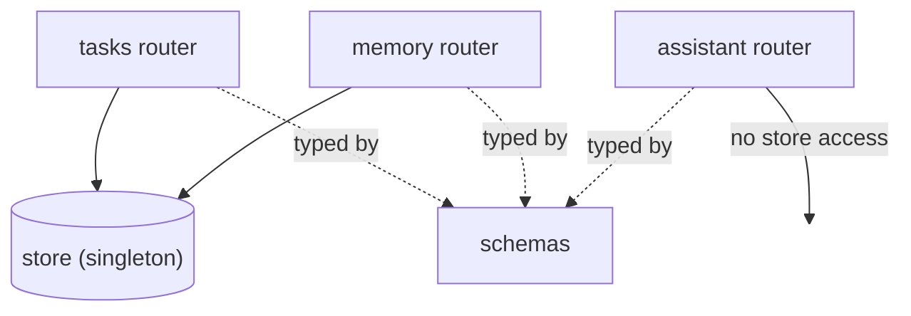

# Data Store & Schemas — Architecture

> Status: draft · Last updated: 2026-06-09 · Owner: _TBD_
>
> Part of the [backend overview](backend-overview.md). The shared persistence layer
> (`store.py`) and the data contracts (`schemas.py`) that every section uses.

## Responsibility

Two cross-cutting concerns, grouped because both serve all feature sections:

- **`store.py`** — the single source of mutable state. Holds the tasks and memories
  lists and the logic to read/mutate them safely. It is the **swap seam**: replace it
  with a real database without touching any router.
- **`schemas.py`** — the Pydantic models that define every request/response shape. The
  shared vocabulary between routers, validation, and OpenAPI docs.

## Internal design (current) — `store.py`

- A single `Store` class, instantiated once as a module-level `store` singleton that the
  routers import. Tasks and memory share this one instance (separate lists + id
  counters: `_next_task_id`, `_next_memory_id`).
- **Process-local & ephemeral** — state lives in memory and **resets on restart**. No
  file, no DB. Intended for the prototype only.
- **Concurrency:** a `threading.Lock` guards every mutation, because FastAPI runs sync
  endpoints in a threadpool (concurrent requests can hit the store). Reads return
  shallow copies (`list(...)`) so callers can't mutate internal state by accident.
- **Methods:**

  | Method | Used by | Behavior |
  | --- | --- | --- |
  | `list_tasks()` | tasks | Copy of the tasks list. |
  | `create_task(label, done)` | tasks | New id, insert front, return task. |
  | `update_task(id, patch)` | tasks | Apply non-`None` patch fields; `None` if id missing. |
  | `list_memories()` | memory | Copy of the memories list. |
  | `create_memory(text, src, tags, color)` | memory | New id, `when="just now"`, insert front. |

- **Seed data** mirrors the frontend exactly: 5 tasks (`App.jsx` `SEED_TASKS`) and 4
  memories (`MemoryScreen.SAMPLE_MEMORIES`), so the UI looks identical whether or not the
  backend is running.

## Internal design (current) — `schemas.py`

- Plain Pydantic `BaseModel`s, grouped by feature with section comments: Assistant
  (`ChatRequest`, `ChatAction`, `ChatResponse`), Tasks (`Task`, `TaskCreate`,
  `TaskUpdate`), Memory (`Memory`, `MemoryCreate`).
- The split between `Task`/`Memory` (full, server-owned `id`) and the `*Create` variants
  (client-supplied subset, with defaults) keeps clients from inventing ids and gives
  free OpenAPI request examples.
- Routers reference these via `response_model=`, so responses are validated/serialized
  consistently and show up in the `/docs` schema.

## Dependencies & interactions

- **`store.py` depends on nothing** in the app (just `threading`). Tasks and Memory
  routers depend on it; Assistant does not.
- **`schemas.py` depends on nothing** (just Pydantic). Every router depends on it.
- Because both have zero inbound coupling to feature logic, they're safe to evolve/
  replace independently — that's the design intent.

## How it _should_ function

> Target design to author. This layer is where the "prototype → real app" jump happens.

- [ ] **Real database — decided (2026-06-10): Supabase-hosted Postgres (free tier), used
      as plain Postgres** via SQLAlchemy + Alembic behind the _same method names_, so
      routers don't change (supersedes the SQLite pick in the architecture review).
      `DATABASE_URL` from env, session-pooler connection string (direct is IPv6-only on
      free tier); **no supabase-py/-js anywhere** — the frontend keeps talking only to
      FastAPI. Define: schema/tables, migrations, connection/session management, and how
      the lock-based concurrency maps onto DB transactions.
- [ ] **Real timestamps** (replace `when="just now"`; derive relative strings on read).
- [ ] **Identity & multi-user.** Today everything is global/single-user. If auth lands,
      the store and most schemas grow a user/owner dimension — decide early.
- [ ] **Schema evolution & API versioning** once a second client (iPhone) consumes these
      contracts.
- [ ] **Validation rules** beyond types (non-empty labels, tag/color constraints, max
      lengths).

## Design decisions & rationale

- _Why a single in-memory singleton?_ — Maximum prototype velocity; routers stay trivial;
  one obvious place to swap in a DB. TODO: confirm the method-signature contract you want
  the future DB store to honor.
- _Why a lock around mutations?_ — Sync endpoints run in a threadpool, so the shared lists
  need protection against concurrent writers. TODO: note how this maps to DB transactions.
- _Why `*Create` schemas separate from full models?_ — Clients shouldn't set `id`/`when`;
  defaults live in one place. TODO.

## Open questions / future work

- The store's method signatures are the de-facto interface for the future DB layer —
  pin them down (and document them) before swapping the backing.
- Where do non-task/memory surfaces (calendar, finance, …) store their data when they
  graduate from React sample data — this same store, or per-domain stores?
