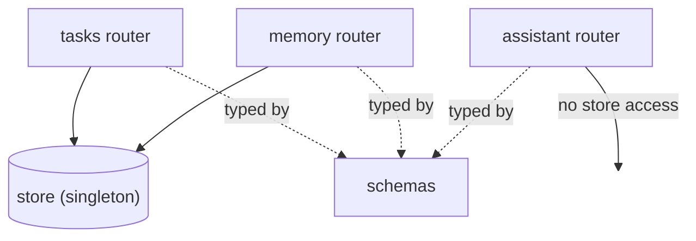

# Data Store & Schemas — Architecture

> Status: built (M1) · Last updated: 2026-06-10 · Owner: _TBD_
>
> Part of the [backend overview](backend-overview.md). The shared persistence layer
> (`store.py` over SQLAlchemy/Postgres) and the data contracts (`schemas.py`).

## Responsibility

Three cross-cutting concerns:

- **`store.py`** — the single data facade. Routers call plain methods that take and
  return API-shaped dicts; all ORM/session detail stays inside. The method-signature
  seam survived the DB swap exactly as designed.
- **`db.py` / `models.py` / `alembic/`** — engine + session plumbing, the SQLAlchemy
  table definitions, and migrations.
- **`schemas.py`** — the Pydantic models that define every request/response shape. The
  shared vocabulary between routers, validation, and OpenAPI docs.

## Internal design (current) — persistence

- **Database: Supabase-hosted Postgres (free tier), used as plain Postgres** (decided
  2026-06-10). `DATABASE_URL` from `backend/.env`; the **session-pooler** string (the
  direct host is IPv6-only on the free tier). `db.normalize_database_url` accepts the
  raw `postgresql://` string Supabase hands out and rewrites it to the psycopg 3
  driver. **No supabase-py/-js anywhere** — the frontend talks only to FastAPI.
- **Engine:** small pool (`pool_size=5, max_overflow=2`) with `pool_pre_ping` so
  pooler-dropped idle connections recycle quietly. SQLite gets the same code path with
  dialect-appropriate options — tests run on it by default, and CI also runs the whole
  suite against a real `pgvector/pgvector:pg17` service container.
- **`Store` facade:** lazily builds its engine from settings on first use (importing
  the app never needs a DB); `store.configure(session_factory)` points the singleton at
  a throwaway engine in tests. Each method opens a short-lived session +
  transaction — the old `threading.Lock` is replaced by DB transactions.
- **Migrations:** Alembic (`backend/alembic/`), URL resolved the same way the app does.
  `alembic upgrade head` before first run; `python -m app.seed` (idempotent) loads the
  design-prototype demo rows.
- **Tables** (`models.py`): `tasks`, `task_reminders`, `memories`, `conversations`,
  `conversation_messages`, and (M3) `events`, `habits`, `habit_completions`,
  `meals`, `water_days`, `nutrition_targets`. Every row: `owner` (defaulted `"me"` —
  single-user today, schema-ready for more) + real UTC timestamps. Display strings
  (`when`, `due`, `late`, `at`, reminder chips) derive on read in `app/display.py` —
  never stored.
- **Free-tier ops** (user-side): ~1-week inactivity pause (daily use avoids it), no
  automated backups → periodic local `pg_dump`, 500 MB cap (revisit at the M5 email
  mirror).

## Internal design (current) — `schemas.py`

- Plain Pydantic `BaseModel`s, grouped by feature with section comments: Assistant
  (`ChatRequest`, `ChatAction`, `ChatResponse`), Tasks (`Task`, `TaskCreate`,
  `TaskUpdate`), Memory (`Memory`, `MemoryCreate`).
- The split between `Task`/`Memory` (full, server-owned `id`) and the `*Create` variants
  (client-supplied subset, with defaults) keeps clients from inventing ids and gives
  free OpenAPI request examples.
- Routers reference these via `response_model=`, so responses are validated/serialized
  consistently and show up in the `/docs` schema.

## Dependencies & interactions

- **`store.py` depends on nothing** in the app (just `threading`). Tasks and Memory
  routers depend on it; Assistant does not.
- **`schemas.py` depends on nothing** (just Pydantic). Every router depends on it.
- Because both have zero inbound coupling to feature logic, they're safe to evolve/
  replace independently — that's the design intent.

## How it _should_ function

- [x] **Real database** — M1: Supabase-flavored Postgres via SQLAlchemy + Alembic behind
      the same `Store` method names; routers unchanged. Lock-based concurrency became
      per-call sessions + transactions.
- [x] **Real timestamps** — M1: UTC facts stored; `when`/`due`/`late` derived on read.
- [x] **Owner dimension** — M1: `owner` column defaulted everywhere (no auth yet).
- [ ] **Schema evolution & API versioning** once a second client (iPhone) consumes these
      contracts.
- [x] **Validation rules** — non-empty labels/text enforced; `group`/`prio`
      Literal-constrained. Tag/color constraints still open.

## Design decisions & rationale

- _Why a single in-memory singleton?_ — Maximum prototype velocity; routers stay trivial;
  one obvious place to swap in a DB. TODO: confirm the method-signature contract you want
  the future DB store to honor.
- _Why a lock around mutations?_ — Sync endpoints run in a threadpool, so the shared lists
  need protection against concurrent writers. TODO: note how this maps to DB transactions.
- _Why `*Create` schemas separate from full models?_ — Clients shouldn't set `id`/`when`;
  defaults live in one place. TODO.

## Open questions / future work

- The store's method signatures are the de-facto interface for the future DB layer —
  pin them down (and document them) before swapping the backing.
- Where do non-task/memory surfaces (calendar, finance, …) store their data when they
  graduate from React sample data — this same store, or per-domain stores?
